<h1>Hi There, I'm Palak 😊</h1>

  

<h3 align="center">Engineering Focused Full Stack Developer</h3>

  

  
  

---

- 🚀 I'm currently working on 
- 📚 I'm currently learning 
- 🛠️ I work using 
- 🤝 I'm looking for help in 
- 💬 Ask me about 
- 📫 How to reach me  
- 🌐 Projects are available at 
- 💻 Know about my experiences 
- 👍 Let's connect and collaborate on exciting projects!

---

> **Engineering focused Full Stack Web Developer** and **2nd year Computer Science undergraduate** passionate about architecting and scaling **AI integrated, production ready web platforms** from early concept to real world deployment.

> Demonstrated interest in embedding **intelligent decision making, automation, and analytics** into modern web architectures. Strong emphasis on **clean architecture, performance optimization, microservice based backends, and cloud native deployment strategies** to deliver reliable, extensible, and high impact software solutions.

---

## 🏆 Achievements

| Recognition | Details |
|:---:|:---:|
| **🥇 SIH Hackathon Winner (Internal)** | Won the internal round of Smart India Hackathon for building an innovative, impact-driven solution |

---

## 🎯 Core Competencies

<table>
<tr>
<td width="50%" valign="top">

### 🌐 Full-Stack Development
- **Frontend**: React, Next.js, TypeScript, Tailwind CSS
- **Backend**: NestJS, Express, FastAPI, Django, Spring
- **Mobile**: React Native, Flutter, Swift, Kotlin
- **Real-time**: WebSockets, GraphQL

</td>
<td width="50%" valign="top">

### 🤖 AI/ML & GenAI
- **Frameworks**: PyTorch, TensorFlow, scikit-learn
- **LLM Stack**: LangChain, LlamaIndex, Autogen
- **MLOps**: MLflow, DVC, Weights & Biases
- **Platforms**: Vertex AI, SageMaker, HuggingFace

</td>
</tr>
<tr>
<td width="50%" valign="top">

### ☁️ Cloud & DevOps
- **Cloud**: AWS, GCP, Azure
- **Orchestration**: Kubernetes, Docker, Terraform
- **CI/CD**: GitHub Actions, ArgoCD, Helm
- **Monitoring**: Prometheus, Grafana, New Relic

</td>
<td width="50%" valign="top">

### ⛓️ Blockchain & Web3
- **Smart Contracts**: Solidity, Hardhat, Foundry
- **Libraries**: ethers.js, web3.js, viem
- **Networks**: Ethereum, Polygon, NEAR
- **Tools**: IPFS, Chainlink, OpenZeppelin

</td>
</tr>
</table>

---

<h3 align="left">Languages and Tools:  </h3>

---

## 📊 GitHub Analytics

 

 

---

<h3 align="left">Connect with me: 🤝</h3>

*"Engineering software that scales, learns, and lasts."*

